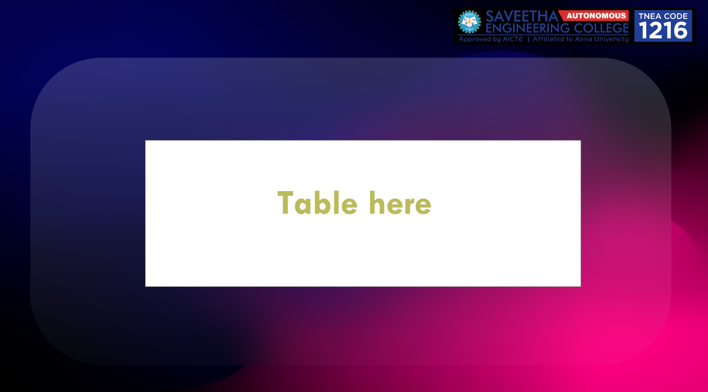

# WebApplication for Event Registration

## AIM:
To create a UX design and develop a web application for event registration.
## DESIGN STEPS:


## DESIGN SCREENS:




## WIREFRAME:


## PROTOTYPE:


## PROGRAM:
### HOME.HTML:
```
<!doctype html>
<html lang="en">

<head>
    <!-- Required meta tags -->
    <meta charset="utf-8">
    <meta name="viewport" content="width=device-width, initial-scale=1, shrink-to-fit=no">

    <!-- Bootstrap CSS -->
    <link rel="stylesheet" href="https://maxcdn.bootstrapcdn.com/bootstrap/4.0.0/css/bootstrap.min.css"
        integrity="sha384-Gn5384xqQ1aoWXA+058RXPxPg6fy4IWvTNh0E263XmFcJlSAwiGgFAW/dAiS6JXm" crossorigin="anonymous">

    <title>WORKSHOP ON BIG DATA</title>
</head>

<body>
    <div class="jumbotron jumbotron-fluid">
        <div class="container text-center">
            <h1 class="display-8">WORKSHOP ON BIG DATA</h1>
        </div>
    </div>
    <div class="container text-center">
        <div class='row '>
            <h2 class="Display-12 col-12 text-center">this is a two day WORKSHOP </h2>
        </div>
        <a href="/register/" class="btn btn-primary btn-lg" role="button">Register</a>
    </div>

    <script src="https://code.jquery.com/jquery-3.2.1.slim.min.js"
        integrity="sha384-KJ3o2DKtIkvYIK3UENzmM7KCkRr/rE9/Qpg6aAZGJwFDMVNA/GpGFF93hXpG5KkN"
        crossorigin="anonymous"></script>
    <script src="https://cdnjs.cloudflare.com/ajax/libs/popper.js/1.12.9/umd/popper.min.js"
        integrity="sha384-ApNbgh9B+Y1QKtv3Rn7W3mgPxhU9K/ScQsAP7hUibX39j7fakFPskvXusvfa0b4Q"
        crossorigin="anonymous"></script>
    <script src="https://maxcdn.bootstrapcdn.com/bootstrap/4.0.0/js/bootstrap.min.js"
        integrity="sha384-JZR6Spejh4U02d8jOt6vLEHfe/JQGiRRSQQxSfFWpi1MquVdAyjUar5+76PVCmYl"
        crossorigin="anonymous"></script>
</body>

</html>
```
### REGISTER.HTML:
```
<!doctype html>
<html lang="en">

<head>
    <!-- Required meta tags --> 
    <meta charset="utf-8">
    <meta name="viewport" content="width=device-width, initial-scale=1, shrink-to-fit=no">

    <!-- Bootstrap CSS -->
    <link rel="stylesheet" href="https://maxcdn.bootstrapcdn.com/bootstrap/4.0.0/css/bootstrap.min.css"
        integrity="sha384-Gn5384xqQ1aoWXA+058RXPxPg6fy4IWvTNh0E263XmFcJlSAwiGgFAW/dAiS6JXm" crossorigin="anonymous">

    <title>Registration Page!</title>
</head>

<body>
    <div class="jumbotron jumbotron-fluid">
        <div class="container text-center">
            <h1 class="display-8" >WORKSHOP ON BIG DATA</h1>
        </div>
    </div>
    <div class="container ">
        <div class="col-12 ">
            <form action="" method="POST">
                
                <div class="form-group">
                    <label for="name">Name</label>
                    <input type="text" class="form-control" id="username" placeholder="Enter your Name" name="username">
                    <small id="name" class="form-text text-muted">Enter your beautiful Name!. :)</small>
                </div>
                <div class="form-group">
                    <label for="institute">Institute</label>
                    <input type="text" class="form-control" id="institute" name="institute"
                        placeholder="Enter the Name of the institute">
                </div>

                <div class="form-group">
                    <label for="emailid">Email address</label>
                    <input type="email" class="form-control" id="emailid" name="emailid" placeholder="Enter email">
                </div>
                <div class="form-group">
                    <label for="number">Contact Number</label>
                    <input type="number" class="form-control" id="phnumber" name="phnumber" placeholder="Contact Number">
                </div>

                <button type="submit" class="btn btn-primary">Submit</button>
        <a href="/home/" class="btn btn-primary btn-lg" role="button">Home</a>

            </form>
        </div>
    </div>

    <script src="https://code.jquery.com/jquery-3.2.1.slim.min.js"
        integrity="sha384-KJ3o2DKtIkvYIK3UENzmM7KCkRr/rE9/Qpg6aAZGJwFDMVNA/GpGFF93hXpG5KkN"
        crossorigin="anonymous"></script>
    <script src="https://cdnjs.cloudflare.com/ajax/libs/popper.js/1.12.9/umd/popper.min.js"
        integrity="sha384-ApNbgh9B+Y1QKtv3Rn7W3mgPxhU9K/ScQsAP7hUibX39j7fakFPskvXusvfa0b4Q"
        crossorigin="anonymous"></script>
    <script src="https://maxcdn.bootstrapcdn.com/bootstrap/4.0.0/js/bootstrap.min.js"
        integrity="sha384-JZR6Spejh4U02d8jOt6vLEHfe/JQGiRRSQQxSfFWpi1MquVdAyjUar5+76PVCmYl"
        crossorigin="anonymous"></script>
</body>

</html>
```
### SUCCESS.HTML:
```
<!doctype html>
<html lang="en">
 
<head>
    <!-- Required meta tags -->
    <meta charset="utf-8">
    <meta name="viewport" content="width=device-width, initial-scale=1, shrink-to-fit=no">

    <!-- Bootstrap CSS -->
    <link rel="stylesheet" href="https://maxcdn.bootstrapcdn.com/bootstrap/4.0.0/css/bootstrap.min.css"
        integrity="sha384-Gn5384xqQ1aoWXA+058RXPxPg6fy4IWvTNh0E263XmFcJlSAwiGgFAW/dAiS6JXm" crossorigin="anonymous">

    <title>Registration Page!</title>
</head>

<body>
    <div class="jumbotron jumbotron-fluid">
        <div class="container text-center">
            <h1 class="display-8" >WORKSHOP ON BIG DATA</h1>
        </div>
    </div>
    <div class="container text-center ">
            <h1 >success</h1>
        <a href="/home/" class="btn btn-primary btn-lg" role="button">Home</a>

    </div>

    <script src="https://code.jquery.com/jquery-3.2.1.slim.min.js"
        integrity="sha384-KJ3o2DKtIkvYIK3UENzmM7KCkRr/rE9/Qpg6aAZGJwFDMVNA/GpGFF93hXpG5KkN"
        crossorigin="anonymous"></script>
    <script src="https://cdnjs.cloudflare.com/ajax/libs/popper.js/1.12.9/umd/popper.min.js"
        integrity="sha384-ApNbgh9B+Y1QKtv3Rn7W3mgPxhU9K/ScQsAP7hUibX39j7fakFPskvXusvfa0b4Q"
        crossorigin="anonymous"></script>
    <script src="https://maxcdn.bootstrapcdn.com/bootstrap/4.0.0/js/bootstrap.min.js"
        integrity="sha384-JZR6Spejh4U02d8jOt6vLEHfe/JQGiRRSQQxSfFWpi1MquVdAyjUar5+76PVCmYl"
        crossorigin="anonymous"></script>
</body>

</html>
```
### FAIL.HTML:
```
<!doctype html>
<html lang="en">
 
<head>
    <!-- Required meta tags -->
    <meta charset="utf-8">
    <meta name="viewport" content="width=device-width, initial-scale=1, shrink-to-fit=no">

    <!-- Bootstrap CSS -->
    <link rel="stylesheet" href="https://maxcdn.bootstrapcdn.com/bootstrap/4.0.0/css/bootstrap.min.css"
        integrity="sha384-Gn5384xqQ1aoWXA+058RXPxPg6fy4IWvTNh0E263XmFcJlSAwiGgFAW/dAiS6JXm" crossorigin="anonymous">

    <title>Registration Page!</title>
</head>

<body>
    <div class="jumbotron jumbotron-fluid">
        <div class="container text-center">
            <h1 class="display-8">WORKSHOP ON BIG DATA</h1>
        </div>
    </div>
    <div class="container text-center ">
        <h1 >fail</h1>
        <a href="/home/" class="btn btn-primary btn-lg" role="button">Home</a>

    </div>

    <script src="https://code.jquery.com/jquery-3.2.1.slim.min.js"
        integrity="sha384-KJ3o2DKtIkvYIK3UENzmM7KCkRr/rE9/Qpg6aAZGJwFDMVNA/GpGFF93hXpG5KkN"
        crossorigin="anonymous"></script>
    <script src="https://cdnjs.cloudflare.com/ajax/libs/popper.js/1.12.9/umd/popper.min.js"
        integrity="sha384-ApNbgh9B+Y1QKtv3Rn7W3mgPxhU9K/ScQsAP7hUibX39j7fakFPskvXusvfa0b4Q"
        crossorigin="anonymous"></script>
    <script src="https://maxcdn.bootstrapcdn.com/bootstrap/4.0.0/js/bootstrap.min.js"
        integrity="sha384-JZR6Spejh4U02d8jOt6vLEHfe/JQGiRRSQQxSfFWpi1MquVdAyjUar5+76PVCmYl"
        crossorigin="anonymous"></script>
</body>

</html>
```
### LISTOFPART.HTML:
```
<!doctype html>
<html lang="en">

<head>
    <!-- Required meta tags -->
    <meta charset="utf-8">
    <meta name="viewport" content="width=device-width, initial-scale=1, shrink-to-fit=no">

    <!-- Bootstrap CSS -->
    <link rel="stylesheet" href="https://maxcdn.bootstrapcdn.com/bootstrap/4.0.0/css/bootstrap.min.css"
        integrity="sha384-Gn5384xqQ1aoWXA+058RXPxPg6fy4IWvTNh0E263XmFcJlSAwiGgFAW/dAiS6JXm" crossorigin="anonymous">

    <title>List of Participants</title>
</head>

<body>
    <div class="jumbotron jumbotron-fluid">
        <div class="container text-center">
            <h1 class="display-8">WORKSHOP ON BIG DATA</h1>
        </div>
    </div>
    <div class="container">
        <table class="table  table-striped table-dark">
            <thead>
                <tr>
                    <th scope="col">Name</th>
                    <th scope="col">Email </th>
                    <th scope="col">Contact number</th>
                    <th scope="col">Institute</th>

                </tr>
            </thead>
            <tbody>
                

                <tr >
                    <td> {{col.username}}</td>
                    <td>{{col.email}}</td>
                    <td>{{col.contnum}}</td>
                    <td>{{col.inst}}</td>

                </tr>
                


            </tbody>
        </table>
    </div>

    <!-- Optional JavaScript -->
    <!-- jQuery first, then Popper.js, then Bootstrap JS -->
    <script src="https://code.jquery.com/jquery-3.2.1.slim.min.js"
        integrity="sha384-KJ3o2DKtIkvYIK3UENzmM7KCkRr/rE9/Qpg6aAZGJwFDMVNA/GpGFF93hXpG5KkN"
        crossorigin="anonymous"></script>
    <script src="https://cdnjs.cloudflare.com/ajax/libs/popper.js/1.12.9/umd/popper.min.js"
        integrity="sha384-ApNbgh9B+Y1QKtv3Rn7W3mgPxhU9K/ScQsAP7hUibX39j7fakFPskvXusvfa0b4Q"
        crossorigin="anonymous"></script>
    <script src="https://maxcdn.bootstrapcdn.com/bootstrap/4.0.0/js/bootstrap.min.js"
        integrity="sha384-JZR6Spejh4U02d8jOt6vLEHfe/JQGiRRSQQxSfFWpi1MquVdAyjUar5+76PVCmYl"
        crossorigin="anonymous"></script>
</body>

</html>
```
### MODELS.PY:
```
from django.db import models
from django.contrib import admin
# Create your models here.

class Participants(models.Model):
    username=models.CharField(max_length=20)
    inst=models.CharField(max_length=20)
    email=models.CharField(max_length=40)
    contnum=models.CharField(max_length=15)

class ParticipantsAdmin(admin.ModelAdmin):
    list_display=("username","email","contnum") 
```
### VIEWS.PY:
```
from django.shortcuts import render

from .models import Participants,ParticipantsAdmin
# Create your views here.
def home(request):
    context={}
    return render(request,"eventapp/home.html",context)

def reg(request):
    context={}
    if request.method == 'POST':
        p1 = Participants()
        p1.username = request.POST.get('username','-')
        p1.email= request.POST.get ('email','-')
        p1.contnum=request.POST.get('contnum','000') 
        p1.inst= request.POST.get('inst','-')

        if len(Participants.objects.all())>15: 
            return render(request,'eventapp/fail.html') 
        else:
            p1.save()
            return render(request,'eventapp/success.html',context)  
    if request.method == 'GET':
        context['username']=''
        context['email']=''
        context['contnum']=''
        context['inst']=''

    return render(request,"eventapp/register.html",context)
    
def lop(request):
    context={}
    context['participants']= Participants.objects.all()
    return render(request,"eventapp/listofpart.html",context)
    

```

## OUTPUT:


## RESULT:
Thus,  a UX design and develop a web application for event registration has been done.
